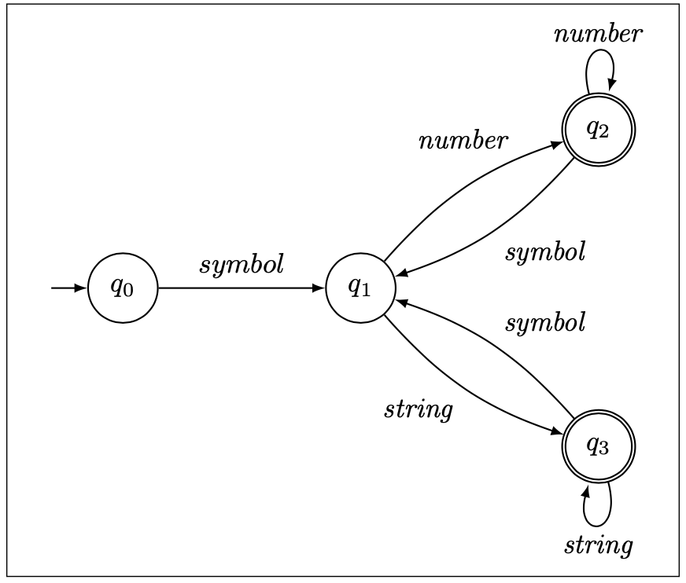

# clojure-rte

This package implements rational type expressions (RTEs) for the [Clojure](https://clojure.org) programming language.
The implementation is based on a similar package for [Common Lisp](https://lisp-lang.org).
The theory of how RTEs work can be found here: [Type-Checking of Heterogeneous Sequences in Common Lisp](https://www.lrde.epita.fr/wiki/Publications/newton.16.els) and [Representing and Computing with Types in Dynamically Typed Languages](https://www.lrde.epita.fr/wiki/Publications/newton.18.phd)

An important aspect of this implementation is that a regular type
expression pattern is represented internally (after compilation with
`rte-compile`) as a symbolic finite automaton.



This means that the
time complexity of matching a sequence, `rte-execute`, against a
pattern is `O(n)` where `n` is the length of the sequence.  I.e., the
time to perform the match is not a function of the complexity of the
pattern; it is only a function of the sequence length.  On the
contrary, the time to compile the pattern depends on the complexity of
the pattern, and may be exponential in worst case.  For this reason,
the programmer is encouraged to arrange that expressions be compiled
either once, and used many times, or if possible to compile the
expressions at compile-time/load-time via:

```clojure
(def *my-rte* (rte-compile ...))
```

## Installation

Download from [LRDE](https://www.lrde.epita.fr/wiki/Home) GitLab [git@gitlab](git@gitlab.lrde.epita.fr:jnewton/clojure-rte.git) or [https](https://gitlab.lrde.epita.fr/jnewton/clojure-rte.git).

## Usage

RTE allows the Clojure programmer to specify regular patterns of types
in sequences.  The pattern language resembles that of regular
expressions for strings, so the user very quickly has an intuition of
how it works.

Whereas with string regular expressions, the leaf level thing you
specify is a character such as `"a*b+"` which means a string of
characters consisting of 0 or more `'a'` characters followed by 1 or
more `'b'` characters; with regular type expressions you specify
type-designators, and repetition information about those types.
Rather than using post-fix notation we use lisp-friendly prefix
notation.  `(:* String)` means a sequence of objects consisting of 0
or more objects of type `String`.  The concept of *followed-by* is made
explicit by the `:cat` operator such as: `(:cat (:* Long) (:+String))`
a sequence consisting of 0 or more objects of type `Long`
followed (in the same sequence) by one or more objects of type `String`.

Which kinds of type designators can be used?  You may use 

- Any type name which is accepted by the `isa?` function.
- Any name which is registered in `*rte-known*`.

The dynamic variable `*rte-known*` is intended for applications to
extend but comes equipped with several useful *quasi-types*. For example,
`integer?` means `(:or Integer
                   Long
                   clojure.lang.BigInt
                   BigInteger
                   Short
                   Byte)`, and `int?` means `(:or Long Integer Short Byte)`.


## Options

RTE supports the following keywords `:cat`, `:and`, `:or`, `:not`, `:+`, `:*`, and `:?`.


* `(:cat ...)` --- Takes 0 or more operands.  Matches a sequence of patterns.

Example 

```clojure
(let [rte (rte-compile '(:cat integer? String))]
  (rte-execute rte [1 "hello"]) ;; true
  (rte-execute rte [1.0 "hello"]) ;; false
  (rte-execute rte [1 2]) ;; false
  (rte-execute rte [1 2 "hello"]) ;; false
  )
```

* `(:+ ...)` --- Takes exactly one operand.  Matches 1 or more times.

Example 

```clojure
(let [rte (rte-compile '(:+ integer?))]
  (rte-execute rte [1 2 3 4 5]) ;; true
  (rte-execute rte [1]) ;; true
  (rte-execute rte []) ;; false
  (rte-execute rte [1.0 2 3.0 4 5]) ;; false
  )
```

* `(:* ...)` --- Takes exactly one operand.  Matches 0 or more times.

Example 

```clojure
(let [rte (rte-compile '(:* integer?))]
  (rte-execute rte [1 2 3 4 5]) ;; true
  (rte-execute rte [1]) ;; true
  (rte-execute rte []) ;; true
  (rte-execute rte [1.0 2 3.0 4 5]) ;; false
  )
```

* `(:? ...)` --- Takes exactly one operand. Matches 0 or 1 time.

Example 

```clojure
(let [rte (rte-compile '(:? integer?))]
  (rte-execute rte [1]) ;; true
  (rte-execute rte []) ;; true
  (rte-execute rte [1 2]) ;; false
  )

(let [rte (rte-compile '(:cat integer? (:? String)))]
  (rte-execute rte [1 2 3 4 5]) ;; true
  (rte-execute rte [1 2 3 4 5 "hello"]) ;; true
  (rte-execute rte [1 2 3 4 5 "hello" "world"]) ;; false
  )
```

* `(:and ...)` ---  Takes 0 or more operands.  Simultaneously matches all of the given patterns.

Example ---  Keyword followed by 1 or two integers, repeated any number of times which is a multiple of 3 total items.

```clojure
(let [rte (rte-compile '(:and (:* (:cat Keyword integer? (:? Integer)))
                              (:+ (:sigma :sigma :sigma))))]
  (rte-execute rte [:x 1 :x 2 :x 3]) ;; true
  (rte-execute rte [:x 1 2 :y 2 3]) ;; true
  (rte-execute rte [:x 1 :y 3]) ;; false
  )
```


* `(:or ...)` --- matches any of the given patterns.

Example  ---  Takes 0 or more operands.  Either 0 or more integers, or 1 or more strings.

```clojure
(let [rte (rte-compile '(:or (:* integer?) (:+ String)))]
  (rex-execute rte []) ;; true, 0 integers
  (rex-execute rte [1 2 3]) ;; true
  (rex-execute rte ["hello" "world"]) ;; true one or more strings
  )
```


* `(:permute ...)` ---  Takes 0 or more operands.  Matches a sequence in any order.

Example --- two integers and a string in any order.

```clojure
(let [rte (rte-compile '(:permute integer? integer? String))]
  (rex-execute rte [1 2 "hello"]) ;; true
  (rex-execute rte [1 "hello" 2]) ;; true
  (rex-execute rte ["hello" 1 2]) ;; true
  (rex-execute rte ["hello" 2]) ;; false
  (rex-execute rte [1 2]) ;; false
  )
```


* `:empty-set` --- identity for `:or`.

Example any number of integers or strings in any order.

```clojure
(let [rte (rte-compile '(:* (:or integer? String)))]
  (rex-execute rte [1]) ;; true
  (rex-execute rte [1 "hello"]) ;; true
  (rex-execute rte ["hello" "world" 1 2 "hello" 3 "world"]) ;; true

```


* `:sigma` --- matches anything once, identity for `:and`.

Example -- any number of repetitions of integer anything String.

```clojure
(let [rte (rte-compile '(:* (:cat integer? :sigma String)))]
  (rex-execute rte []) ;; true
  (rex-execute rte [1]) ;; false
  (rex-execute rte [1 2]) ;; false
  (rex-execute rte [1 "hello" 2]) ;; true
  (rex-execute rte [1 "hello" 2 3 "world" 4 1 "hello" 2 3 "world" 4]) ;; true
  )
```

* `:epsilon` --- matching nothing once, identity for `:cat`.  This is probably
not useful to the end user.  However, internally `(:? x)` expands to `(:or x :epsilon)`.

* `(:not ...)` --- Takes exactly one operand.  Matches any sequence
except ones which match the pattern.  This can be confusing.

Example -- `String` matches a singleton sequence whose element is a string.  So `(:not String)` matches any sequence except one of length 1 consisting of a string, including matching the empty sequence.

```clojure
(rte-match '(:not String] []) ;; true
(rte-match '(:not String] ["hello"]) ;; false
(rte-match '(:not String] ["hello" "world"]) ;; true
```

If you want to match a sequence like  `[:x 100 :y 200 :z 300]`  but not if any of the values after the keyword is a String, use the following.
`(rte-match '(:* (:cat Keyword (:and :sigma (:not String)))) ...)`, because `(:and :sigma (:not String))` will match any singleton sequence whose element is NOT a string.


## Examples

```clojure
(rte-match '(:cat (:* (:cat clojure.lang.Keyword java.lang.Long))
                                  (:? String))
           '(:x 1 :y 2 :z 42)) ;; --> true

(let [rte (rte-compile '(:cat (:* (:cat clojure.lang.Keyword java.lang.Long))
                                  (:? String)))]
  (rte-execute '(:x 1 :y 2 :z 42)) ;; --> true
  (rte-execute '(:x 1 :y 2 :z 42 "Hello")) ;; --> true
  (rte-execute '(:x 1 :y 2 :z 42 "Hello" "World")) ;; --> false
)
```


### Bugs

```clojure
(rte-match '(:cat (:* (:cat clojure.lang.Keyword (:not java.lang.Long)))
                                  (:? String))
           '(:x 1 :y 2 :z 42))
;; --> false
```

This does not yet work.

## Contributors

[Jim Newton](https://www.lrde.epita.fr/wiki/User:Jnewton)

## License
```
;; Copyright (c) 2020 EPITA Research and Development Laboratory
;;
;; Permission is hereby granted, free of charge, to any person obtaining
;; a copy of this software and associated documentation
;; files (the "Software"), to deal in the Software without restriction,
;; including without limitation the rights to use, copy, modify, merge,
;; publish, distribute, sublicense, and/or sell copies of the Software,
;; and to permit persons to whom the Software is furnished to do so,
;; subject to the following conditions:
;;
;; The above copyright notice and this permission notice shall be
;; included in all copies or substantial portions of the Software.
;;
;; THE SOFTWARE IS PROVIDED "AS IS", WITHOUT WARRANTY OF ANY KIND,
;; EXPRESS OR IMPLIED, INCLUDING BUT NOT LIMITED TO THE WARRANTIES OF
;; MERCHANTABILITY, FITNESS FOR A PARTICULAR PURPOSE AND
;; NONINFRINGEMENT. IN NO EVENT SHALL THE AUTHORS OR COPYRIGHT HOLDERS BE
;; LIABLE FOR ANY CLAIM, DAMAGES OR OTHER LIABILITY, WHETHER IN AN ACTION
;; OF CONTRACT, TORT OR OTHERWISE, ARISING FROM, OUT OF OR IN CONNECTION
;; WITH THE SOFTWARE OR THE USE OR OTHER DEALINGS IN THE SOFTWARE.
```

<!--  LocalWords:  Clojure LRDE GitLab gitlab https rte src img RTEs
 -->
