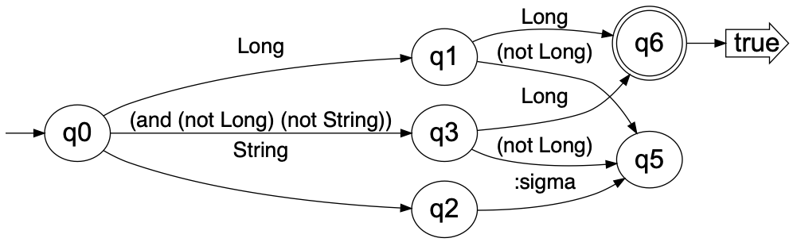
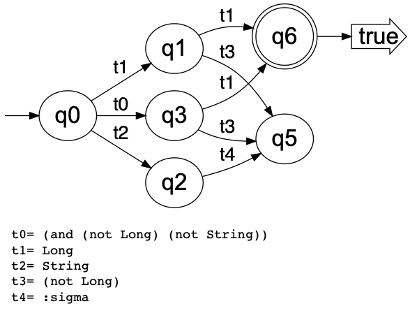

# clojure-rte

This package implements rational type expressions (RTEs) for the 
[Clojure](https://clojure.org) programming language.
The implementation is based on a similar package for 
[Common Lisp](https://lisp-lang.org).
The theory of how RTEs work can be found here: 
[Type-Checking of Heterogeneous Sequences in Common Lisp](https://www.lrde.epita.fr/wiki/Publications/newton.16.els) and [Representing and Computing with Types in Dynamically Typed Languages](https://www.lrde.epita.fr/wiki/Publications/newton.18.phd)

An important aspect of this implementation is that a regular type
expression pattern is represented internally (after compilation with
`rte-compile`) as a deterministic symbolic finite automaton.


This means that after the pattern has been compiled, the time complexity of 
matching a sequence, `rte-match`, against a pattern has linear time complexity `O(n)` where `n` is the 
length of the sequence.  I.e., the time to perform the match is not a function 
of the complexity of the pattern; it is only a function of the sequence
length.  On the contrary, the time to compile the pattern depends on
the complexity of the pattern, and may be exponential in worst case.
For this reason, patterns are compiled and automatically memoized
via the clojure [`memoize`](https://clojuredocs.org/clojure.core/memoize)
function.

In some cases the sequence can be determined to match the pattern
without examining the entire sequence.  For example if the pattern is,
`(:cat Long (:* Double))`, then as soon as the first item fails to be
a `Long`, we need not examine the rest of the sequence because we know
it failed to match. Likewise if the pattern is `(:cat Long (:*
:sigma))`, then after verifying that the first element is a `Long`, we
need not examine the remaining elements because we know it has
matched.

If the given sequence is a lazy sequence with side-effects, in some
cases the side effects may be circumvented.  The caller cannot be
assured that the side-effects will be achieved.

## Installation

Download from [LRDE](https://www.lrde.epita.fr/wiki/Home) GitLab 

```
git clone git@gitlab.lrde.epita.fr:jnewton/clojure-rte.git)
```
 or
```
git clone https://gitlab.lrde.epita.fr/jnewton/clojure-rte.git
```

## Usage

RTE allows the Clojure programmer to specify regular patterns of types
in sequences.  The pattern language resembles that of regular
expressions for strings, so the user very quickly has an intuition of
how it works.

Whereas with string regular expressions, where the leaf level thing you
specify is a character such as `"a*b+"` which means a string of
characters consisting of zero or more `'a'` characters followed by one or
more `'b'` characters; with regular type expressions you specify
type-designators, and repetition information about those types.
Rather than using post-fix notation we use lisp-friendly prefix
notation.  `(:* String)` means a sequence of objects consisting of zero
or more objects of type `String`.  The concept of *followed-by* is made
explicit by the `:cat` operator such as: `(:cat (:* Long) (:+String))`
a sequence consisting of zero or more objects of type `Long`
followed (in the same sequence) by one or more objects of type `String`.

Which kinds of type designators can be used?  You may use 

- Any type name which is a symbol, `T` for which `(class? (resolve T))` evaluates to Boolean true.
- Any name which is an element of the set returned from `(supported-non-trivial-types)`, equivalently if `(registered-type? T)` returns `true`.
- Any *quasi-type* name mentioned in `*rte-known*`.

The dynamic variable `*rte-known*` is intended for applications to
extend but comes equipped with several useful *quasi-types*. For example,
`integer?` means `(:or Integer
                   Long
                   clojure.lang.BigInt
                   BigInteger
                   Short
                   Byte)`, and `int?` means `(:or Long Integer Short Byte)`.


## Options

RTE supports the following keywords `:cat`, `:+`, `:*`, `:?`, `:exp`, `:and`, `:or`, `:permute`, `:contains-any`, `:contains-every`, `:contains-none`, 
`:empty-set`, `:sigma`, `:epsilon`, and `:not`.


* `(:cat ...)` --- Takes 0 or more operands.  Matches a sequence of patterns.

Example 

```clojure
(let [rte (rte-compile '(:cat integer? String))]
  (rte-match rte [1 "hello"]) ;; true
  (rte-match rte [1.0 "hello"]) ;; false
  (rte-match rte [1 2]) ;; false
  (rte-match rte [1 2 "hello"]) ;; false
  )
```

* `(:+ ...)` --- Takes exactly one operand.  Matches 1 or more times.

Example 

```clojure
(let [rte (rte-compile '(:+ integer?))]
  (rte-match rte [1 2 3 4 5]) ;; true
  (rte-match rte [1]) ;; true
  (rte-match rte []) ;; false
  (rte-match rte [1.0 2 3.0 4 5]) ;; false
  )
```

* `(:* ...)` --- Takes exactly one operand.  Matches 0 or more times.

Example 

```clojure
(let [rte (rte-compile '(:* integer?))]
  (rte-match rte [1 2 3 4 5]) ;; true
  (rte-match rte [1]) ;; true
  (rte-match rte []) ;; true
  (rte-match rte [1.0 2 3.0 4 5]) ;; false
  )
```

* `(:? ...)` --- Takes exactly one operand. Matches 0 or 1 time.

Example 

```clojure
(let [rte (rte-compile '(:? integer?))]
  (rte-match rte [1]) ;; true
  (rte-match rte []) ;; true
  (rte-match rte [1 2]) ;; false
  )

(let [rte (rte-compile '(:cat integer? (:? String)))]
  (rte-match rte [1 2 3 4 5]) ;; true
  (rte-match rte [1 2 3 4 5 "hello"]) ;; true
  (rte-match rte [1 2 3 4 5 "hello" "world"]) ;; false
  )
```

* `(:exp n pattern)` ---  `:exp` takes exactly two arguments, indicating the number of occurances, and a pattern.

Example --- to match a sequence 0 to 5 Integers,

```clojure
(let [rte (rte-compile '(:exp 5 (:? integer?)))]
   (rte-match rte []) ;; true
   (rte-match rte [1 2 3]) ;; true
   (rte-match rte [1 2 3 3 4 5 6]) ;; false
   )
```

* `(:and ...)` ---  Takes 0 or more operands.  Simultaneously matches all of the given patterns.

Example ---  Keyword followed by 1 or two integers, repeated any number of 
times which is a multiple of 3 total items.

```clojure
(let [rte (rte-compile '(:and (:* (:cat Keyword integer? (:? integer?)))
                              (:+ (:sigma :sigma :sigma))))]
  (rte-match rte [:x 1 :x 2 :x 3]) ;; true
  (rte-match rte [:x 1 2 :y 2 3]) ;; true
  (rte-match rte [:x 1 :y 3]) ;; false
  )
```


* `(:or ...)` --- matches any of the given patterns.

Example  ---  Takes 0 or more operands.  Either 0 or more integers, or 1 or 
more strings.

```clojure
(let [rte (rte-compile '(:or (:* integer?) (:+ String)))]
  (rte-match rte []) ;; true, 0 integers
  (rte-match rte [1 2 3]) ;; true
  (rte-match rte ["hello" "world"]) ;; true one or more strings
  )
```


* `(:permute ...)` ---  Takes 0 or more operands.  Matches a sequence in any order.

Example --- two integers and a string in any order.  

WARNING, the number of permutations explodes as n!.  Using `:permute`
of a large number of operations will make the compilation extremely
slow, and perhaps exhaust virtual memory.

```clojure
(let [rte (rte-compile '(:permute integer? integer? String))]
  (rte-match rte [1 2 "hello"]) ;; true
  (rte-match rte [1 "hello" 2]) ;; true
  (rte-match rte ["hello" 1 2]) ;; true
  (rte-match rte ["hello" 2]) ;; false
  (rte-match rte [1 2]) ;; false
  )
```

* `(:contains-any ...)` ---  Takes 0 or more operands.  Matches a sequence if it contains a factor which 
matches any of the given patterns.  A *factor* is a consecutive subsequence: `[1 2 3]` is a factor of `[0 1 2 3 4]`
but `[2 4]` is not a factor.

```clojure
(let [rte (rte-compile '(:contains-any integer?))]
  (rte-match rte [1 2 "hello"]) ;; true
  (rte-match rte ["hello" 2 "world"]) ;; true
  )

(let [rte (rte-compile '(:contains-any integer? String))]
  (rte-match rte [1 2 "hello"]) ;; true
  (rte-match rte ["hello" 2 "world"]) ;; true
  (rte-match rte [1 2 false]) ;; true
  (rte-match rte [true "hello" false]) ;; true
  )

(let [rte (rte-compile '(:contains-any (:cat Long Long) (:cat Double Double)))]
  (rte-match rte [1 2 "hello"]) ;; true because it contains (:cat Long Long)
  (rte-match rte ["hello" 2.0 3.0 "world"]) ;; true (:cat Double Double)
  (rte-match rte [1 false 2 false 1.0 false 2.0]) ;; false
  )
```

* `(:contains-every ...)` ---  Takes 0 or more operands.  Matches a sequence if it for each pattern
the sequence contains a factor which matches the pattern.

```clojure
(let [rte (rte-compile '(:contains-every integer?))]
  (rte-match rte [1 2 "hello"]) ;; true
  (rte-match rte ["hello" 2 "world"]) ;; true
  )

(let [rte (rte-compile '(:contains-every integer? String))]
  (rte-match rte [1 2 "hello"]) ;; true
  (rte-match rte ["hello" 2 "world"]) ;; true
  (rte-match rte [1 2 false]) ;; false because it does not contains String
  (rte-match rte [true "hello" false]) ;; false because it does not contain integer?
  )

(let [rte (rte-compile '(:contains-any (:cat Long Long) (:cat Double Double)))]
  (rte-match rte [false 1 2 "hello" 1.0 2.0]) ;; true because it contains (:cat Long Long) and also (:cat Double Double)
  (rte-match rte [1 2 "hello"]) ;; false because it does not contain (:cat Double Double)
  (rte-match rte ["hello" 2.0 3.0 "world"]) ;; false because it does not contain (:cat Long Long)
  )
```

* `(:contains-none ...)` ---  Takes 0 or more operands.  This is the same as `(:not (:contains-any ...))`.
Warning, `(:contains-any)` with no arguments is the same as `:epsilon`, so `(:contains-none)` is the
same as `(:not :epsilon)`.

* `:empty-set` --- identity for `:or`.

Example any number of integers or strings in any order.

```clojure
(let [rte (rte-compile '(:* (:or integer? String)))]
  (rte-match rte [1]) ;; true
  (rte-match rte [1 "hello"]) ;; true
  (rte-match rte ["hello" "world" 1 2 "hello" 3 "world"]) ;; true

```


* `:sigma` --- matches anything once, identity for `:and`.

Example -- any number of repetitions of integer anything String.

```clojure
(let [rte (rte-compile '(:* (:cat integer? :sigma String)))]
  (rte-match rte []) ;; true
  (rte-match rte [1]) ;; false
  (rte-match rte [1 2]) ;; false
  (rte-match rte [1 "hello" 2]) ;; true
  (rte-match rte [1 "hello" 2 3 "world" 4 1 "hello" 2 3 "world" 4]) ;; true
  )
```

* `:epsilon` --- matching nothing once, identity for `:cat`.  This is probably
not useful to the end user.  However, internally `(:? x)` expands to 
`(:or x :epsilon)`.

* `(:not ...)` --- Takes exactly one operand.  Matches any sequence
except ones which match the pattern.  This can be confusing. See section
[Hierarchical Sequences](#hierarchical-sequences) for details.

Example -- `String` matches a singleton sequence whose element is a string.  
So `(:not String)` matches any sequence except one of length 1 consisting of a
string, including matching the empty sequence.

```clojure
(rte-match '(:not String) []) ;; true
(rte-match '(:not String) ["hello"]) ;; false
(rte-match '(:not String)["hello" "world"]) ;; true
```

## Examples

```clojure
(rte-match '(:cat (:* (:cat clojure.lang.Keyword java.lang.Long))
                                  (:? String))
           '(:x 1 :y 2 :z 42)) ;; --> true

(let [rte (rte-compile '(:cat (:* (:cat clojure.lang.Keyword java.lang.Long))
                                  (:? String)))]
  (rte-match '(:x 1 :y 2 :z 42)) ;; --> true
  (rte-match '(:x 1 :y 2 :z 42 "Hello")) ;; --> true
  (rte-match '(:x 1 :y 2 :z 42 "Hello" "World")) ;; --> false
)
```

## Confusion with negative semantics

As mentioned above the semantics of `:not` can be confusing and unintuitive.

The pattern `(:and :sigma (:not String))` 
matches a singleton sequence whose element is not a string; however,
`(:not String)` will match any sequence except a singleton sequence whose 
element is a string.  This becomes confusing in concatenations.

The pattern `(:cat (:not String) Long)` will refuse match 
`["hello" 4]` which is probably what the user intended.  But it will also match 
`[1 2 3 4 5]`.  Why?  Because `[1 2 3 4]` matches `(:not String)`, and `[5]`
matches `Long`.

If you really intended to exclude `["hello" 4]` and also exclude `[1 2 3 4 5]`,
the rte pattern needs more information.  For example, you might limit the 
sequence to sequences of two entries.  
`(:and (:cat :sigma :sigma) (:cat (:not String) Long))` which will refuse to 
match `[1 2 3 4 5]`, but will match `[1.2 3]`, because `[1.2]` is not a 
singleton sequence of String.

If you want to match a sequence like `[:x 100 :y 200 :z 300]` but not
if any of the values after the keyword is a String, you may use the following.
`(rte-match '(:* (:cat Keyword (:and :sigma (:not String)))) ...)`,
because `(:and :sigma (:not String))` will match any singleton
sequence whose element is NOT a string.

A feature which is not yet implemented will alleviate some of this confusion.
The *type designator* `(not ...)` will represent the set of all values except
those of a designated type.  `(:cat (not String) Long)` (once supported by RTE) 
will match sequence of length 2 whose second element is a `Long`, and whose 
first element is a member of the type `(not String)`, i.e., the set of all 
values which are not strings.

See section [Not yet implemented](#not-yet-implemented) for more
details of the proposed type designator syntax.


## Hierarchical Sequences

The `rte` type designator may be used to indicate hierarchical
sequences, i.e., sequences some of whose elements are themselves
sequences.  The type designator `(rte (:* integer?))` indicates the
set of sequences whose elements are sequences of any length consisting
of integers.

The rte pattern `(:* (rte (:+ integer?)))` matches a sequence of 0 or
more non-empty sequences whose elements are integers.

The pattern `(:* (:or (rte (:* String)) (rte (:* integer?))))` matches
a sequence of sequences each of which contains only strings or only
Integers, e.g.,

```clojure
(rte-match '(:* (:or (rte (:* String)) (rte (:* integer?))))
  [[1 2 3]
   ["hello" "world"]
   [10 20 30 40 50]])
==> true
```
but not
```clojure
(rte-match '(:* (:or (rte (:* String)) (rte (:* integer?))))
  [[1 2 3]
   ["hello" "world"]
   [10 "20" 30 "40" 50]])
==> false
```

## Abbreviating patterns

If you have several patterns which you want to name either for reuse
or readability, use the macro `with-rte`.

```clojure
(with-rte [::a (:permute Long Long String) ;; not quoted
           ::b (:permute Double Double String) ;; not quoted
           ]
  (let [rte (rte-compile '(:cat ::a ::a ::b ::b))]
    (rte-match rte [2 2 "hello"
                      2 "hello" 2
                      4.0 4.0 "world"
                      "world" 4.1 4.2]) ;; true
  ))
```

The semantics
of `(with-rte [...] ...)` vs `(rte ...)` may be confusing.
`(rte pattern)` designates a subtype of sequence whose
content matches the designated pattern.  On the other hand
`(with-rte [...] ...)` specifies sub-patterns which are interpolated into 
another pattern.

`(:cat (rte x) (rte y))` matches a two element sequence whose elements
are sequences *a* and *b*, where *a* matches the pattern *x* and *b*
matches the pattern *y*.

`(with-rte [::x ... ::y ...] (rte-match '(:cat ::x ::y) ...))` matches a 
sequence of two concatenated
sequence *a* and *b*, where *a* matches the pattern *::x* and *b*
matches the pattern *::y*.  E.g., 

```clojure
(with-rte [::x (:+ Long)
           ::y (:+ Double)]

  (let [pat (rte-compile '(:cat ::x  ::y))]
    ;; the same as (rte-compile '(:cat (:+ Long) (:+ Double)))
    (rte-match pat [1 2 3 1.2 3.4 5.6 7.8]) ;; true
    (rte-match pat [[1 2 3] [1.2 3.4 5.6 7.8]]) ;; false
  ))

(let [pat (rte-compile '(:cat (rte (:+ Long)) (rte (:+ Double))))]
  (rte-match pat [1 2 3 1.2 3.4 5.6 7.8]) ;; false
  (rte-match pat [[1 2 3] [1.2 3.4 5.6 7.8]]) ;; true
)
```

If you want to call `with-rte` programmatically, there is a lower
level function `call-with-rte` which may be easier to use for that
purpose.


## Algebra of RTEs

Given two RTEs it is possible to ask questions of habitation and
vacuity.  For example, given two patterns, one might ask, is there a
sequence which matches neither of the patterns?  Or to ask whether
every sequence which matches one also matches the other.

* `rte-trace` takes an rte pattern (compiled or not) and
  returns a sequence of type designators indicating the values of a
  sequence which will satisfy the original pattern.

```clojure
(rte-trace '(:and (:cat :sigma :sigma)
                  (:* integer?)))

==> [Byte Byte]

(rte-trace (rte-compile '(:and (:cat :sigma :sigma)
                               (:* (:and :sigma (:not Byte)))
                               (:* integer?))))

==> [Long Long]
```

* If you have two patterns, and you'd like to know what sequence matches one 
but not the other. For example to find a sequence which contains 1 or more 
`integer?` but does not contain 0 or more `Number`.

```clojure
(let [pattern1 '(:+ integer?)
      pattern2 '(:* Number)]
  (rte-trace (rte-compile `(:and ~pattern1 (:not ~pattern2)))))

==> [Byte]
```

Another example.  `(:* (:cat keyword? :sigma))` matches a sequence of
alternating `Keyword` anything pairs such as 
`[:x 100 :y "hello"]`. `(:cat (:* :sigma) keyword? (:* :sigma))` matches any
sequence which contains at least one `Keyword` somewhere.  So does
there exist a sequence which matches the first but not the second?

```clojure
(let [pattern1 '(:* (:cat keyword? :sigma))
      pattern2 '(:cat (:* :sigma) keyword? (:* :sigma))]
  (rte-trace (rte-compile `(:and ~pattern1 (:not ~pattern2)))))

==> []
```

We see that indeed the empty sequence matches `pattern1` but does not match 
`pattern2`.

## API

### (`rte-compile` rte-pattern)
Compiles an rte pattern into an internal representation representing a
DFA (deterministic finite automaton).  The representation is designed
to be human readable for debugging purposes, but its structure is not
intended as an API.  I.e., the structure might change in future
releases.

The return value of this function is memoized.  Thus if the same rte
pattern is encountered again the previously compiled dfa is returned
as an `O(1)` operation.

The return value of `rte-compile` may be used as first argument of `rte-match`.

Note about performance.  You may force an rte to be compiled at
program load/compile time by defining at top level using `def`.

```clojure
(def my-rte (rte-compile ...)) ;; compile rte at load time
```

In the following case the RTE will be compiled at run-time, the first
time the code is evaluated.

```clojure
(defn foo [args ...]
  (let [rte (rte-compile '(:cat (:* Long) (:* Double) (:* String)))]
    ...
    ... (rte-match rte ...)
    ...
    ))
```


### (`rte-match` rte items)

Returns Boolean value.

Match a given sequence against a pre-compiled RTE pattern.

```clojure
(let [rte (rte-compile '(:cat (:* String) (:* Long) (:* Double)))]
  (rte-match rte ["hello" "world" 1 2 3]) ;; true
  (rte-match rte ["hello" "world" 1.0 2.0 3.0]) ;; true
  (rte-match rte ["hello" "world" 1.0 2.0 3]) ;; false
  )
==> true
```

```clojure
(rte-match '(:cat (:* String) (:* Double)) ["hello" "world" 1 2 3])
==> true
```


### (`with-rte` bindings & body)
See section [Abbreviating patterns](#abbreviating-patterns) for more information

### (`rte-trace` rte)

See section [Algebra of RTEs](#algebra-of-rtes) for more information.


## Debugging

Once a dfa has been created with a call to `rte-compile` or `rte-to-dfa`, you 
may draw the corresponding graph using the `dfa-to-dot` function.

```clojure
(clojure-rte.dot/dfa-to-dot
  (rte-compile '(:and (:cat :sigma :sigma) (:cat (:not String) Long)))
  :title "Example"
  :abbrev false
  :view true)
```



```clojure
(clojure-rte.dot/dfa-to-dot
  (rte-compile '(:and (:cat :sigma :sigma) (:cat (:not String) Long)))
  :title "Example"
  :abbrev true
  :view true)
```



## Extensible types

The namespace `clojure-rte.type` defines a type system which extends the
Clojure built-in type system.   Types are sets of objects. Some types may be 
designated via so-called *type designators*.

A *type designator* is defined by the following recursive definition.  If `A` 
and `B` are type designators and `f` is a symbol whose global value 
`(resolve 'f)` is a unary predicate function, then

  - Any symbol designates a type, provided it can be resolved with the function `resolve`, and the resulting value is `true` according to the `class?` predicate.  I.e., if the predicate `(fn [x] (and (symbol? x) (resolve x) (class? (resolve x))))` is returns `true`.

  - `(and A B)` is a type designator, designating the set of values which are simultaneously of type `A` and `B`. `(and ...)` may have arbitrarily many operands. `(and A)` means `A`, and `(and)` means the empty set of all possible.

  - `(or A B)` is a type designator, designating the set of values which are of type `A` or of type `B`, or perhaps of both. `(or ...)` may have arbitrarily many operands.  `(or A)` means `A`, and `(or)` means the empty set of values.

  - `(not A)` is a type designator, designating the set of values which are *not* of type `A`.

  - `(= x)`  is a type designator, designating the set of all values which are equal `=` to its literal operand.  For example `(= 42)` is the set of all values equal to 42, which include among others the `java.lang.Long 42`, the `java.lang.Short 42`, and the  `java.lang.Byte 42`.

  - `(member x y z ...)` is a type designator equivalent to `(or (= x) (= y) (= z) ...)`.
  
  - `(rte pattern)` is a type designator which specifies the set of sequences which match the given rte pattern.  For example, the type `(rte (:cat Long String))` is the set of two element sequences whose first element is a `Long` and whose second element is a string.


The user interface to `clojure-rte.type` includes the following functions:

* `typep [value type-designator]` --- predicate to determine whether a given object is an element of a designated type.

Example 
```clojure
(typep 42 'Long) ;; true
(typep "42" '(not Long)) ;; true
```

* `subtype? [sub super]` --- predicate to determine whether one type is a subtype of another.  I.e., for any `x` in `t1` is it tru that `x` is also in `t2` ?  There are three possible answers to this question, `true`, `false`, and `:dont-know`.

Example 
```clojure
(subtypep 'Long '(or Long Double)) ;; true
(subtype 'Long '(or String (not Long))) ;; false
```

* `disjoint? [t1 t2]` --- predicate to determine whether two types are disjoint in the sense that their intersection is empty. There are three possible answers to this question, `true`, `false`, and `:dont-know`.

Example 
```clojure
(disjoint? 'Long 'Double) ;; true
(disjoint 'Number 'java.io.Serializable) ;; false
```

* `inhabited? [type-designator]` --- predicate to determine whether there exists an element of a given type.  Any type which is not inhabited is vacuous. There are three possible answers to this question, `true`, `false`, and `:dont-know`.

Example 
```clojure
(inhabited? 'Long) ;; true
(inhabited? '(rte (:and (:+ Number) (:+ String)))) ;; false
```

## How to extend the type system

An application may extend the type system by adding a new type
designator syntax.  To do so, several steps must be followed.

### Registering the existance of the new type

To declare a new type as existing and supported by rte, you must register
by added a method via `defmethod registered-type?` returning `true.

```clojure
(defmethod registered-type? 'my-type [_] true)
```

### Determine whether a given element is a member of the new type

Additional several methods must be added to allow
the system to reason about the new type.


* `typep [value type-designator]` --- Applications defining new types
should define a method on `typep` which decides whether a given value 
is a member of that type.  This method will be called when the sytem has 
already determined that the type designator is a `sequential?` whose first 
element is your type name e.g., `my-type`. Thus the logic within the method 
body has the task of determining whether the given  object `my-value` is an 
element of the designated type.


 Example:
```clojure
(defmethod typep 'member [a-value [_type & others]]
  (some #{a-value} others))

(defmethod typep 'my-type [a-value [_type & others]]
  ... some logic ...)
```

### Determine various characteristics of the new type

The system reasons about types via an interface defined by the
functions: `registered-type?`, `typep`, `inhabited?`, `disjoint?`, and 
`subtype?`.  While you are expected to add a method `registered-type?` and 
`typep` for your new type, you must not add methods to `inhabited?`, 
`disjoint?`, or `subtype?`. To fully implement a new type, you must provide 
several methods which extend some built-in multimethods:  `-inhabited?`, 
`-disjoint?`, and `-subtype?`.

These multimethods should never be called; rather each method thereof
will be called by a mechanism different from the multimethod.  In each
case, the system calls the methods in some order (which you cannot
control) until one method returns either `true` or `false`.  As a
convention each method should return `:dont-know` if it cannot decide
between `true` and `false`.

The task of each method is to determine whether or not the type in question
is in play.  For example, if you are implementing a type named `my-type`,
then your method may be called with other type designators other than `my-type`
in which your method should recognize this and return `:dont-know`.

For example, if you are implementing `my-type` and `-inhabited?` is called with
argument `(foo 1 2 3)`, your `-inhabited?` method should recognize that
the type is not `(my-type ...)` and should return `:dont-know`.  If the
argument is `(my-type ...)`, then and only then should it examine the arguments
and proceed making its decision to return `true` or `false`.

When installing a method such as `-inhabited?`, for an application specific 
type, it is the responsibility of the method to detect whether the type 
designator syntax is correct, and return `:dont-know` or signal an error.
If the method does not recognize the syntax, then return `:dont-know`.
If the method recognizes the syntax to be invalid, then signal an error.
For example, if you are implementing `my-type`, and you have determined that
any `my-type` type designator must specify exactly one operand such as 
`(my-type 3)`, and if the given type designator is `(my-type 3 4)`, you should 
determine that the number of operands IS NOT 1, so you my signal an error such 
as with a call to:
```clojure
(defmethod -inhabited? 'my-type [type-designator]
  (cond
   (not (sequential? type-designator))
   :dont-know

   (not= 'my-type (first type-designator))
   :dont-know

   (not= 2 (count my-type))
   (throw (ex-info (format "invalid syntax %s" type-designator)
                   {:type-name 'my-type
                    :type-designator type-designator}))

   :else
   ... some logic ...
   )
```

### Determining whether a type is inhabited or vacuous

* `-inhabited?` ---   

Applications may install methods via `(defmethod -inhabited? ...)`.
The method accepts one argument which is a type-designator,
pontentially application specific.  The method should examine the type
designator and return `true`, `false`, or `:dont-know` depending on
whether there exists an object of this type.  If the designated type
is empty, return `false`; if it is not empty, return `true`; if it is
not possible to programmatically determine whether the type is empty
(e.g., because of the halting problem, or because not enough
information is given) return `:dont-know`.


When `inhabited?` (the public calling interface) is called,
the methods of `-inhabited?` are called in some order
(`:primary` first) until one method returns `true` or `false`,
in which case `inhabited?` returns that value.
If no method returns `true` or `false`, then the function
`*inhabited?-default*` is called, and its value returned.
If `inhabited?` is called with a 3rd argument, then
`*inhabited?-default*` is dynamically bound to that value."

```clojure
(defmethod -inhabited? 'my-type [type-designator]
  (if (and (sequential? type-designator)
           (= 'my-type (first type-designator)))
    (... some logic ...)
    :dont-know))
```

### Determining whether two types are disjoint or intersecting.


* `-disjoint?` ---   

Applications may install methods via `(defmethod -disjoint? ...)`.
The method accepts two arguments which are type-designators,
`[t1 t2]`,  pontentially application specific.
The method should examine the designated types to determine whether
the designated types are disjoint, i.e., whether they have no
element in common, i.e., whether their intersection is empty.
The method must return `true`, `false`, or `:dont-know`.
The function, disjoint?, will call `(-disjoint? t1 t2)`
and also `(-disjoint? t2 t1)` if necessary, therefore
the methods need only check one or the other.
When `disjoint?` (the public calling interface) is called,
the methods of -disjoint? are called in some order
(`:primary` first) until one method returns `true` or `false`,
in which case `disjoint?` returns that value.
If no method returns `true` or `false`, then the function
`*disjoint?-default*` is called, and its value returned.
If `disjoint?` is called with a 3rd argument, then
`*disjoint?-default*` is dynamically bound to that value.
    

### Determining whether one type is a subtype of another

* `-subtype?` ---  

Applications may install methods via `(defmethod -subtype? ...)`.
The method accepts two arguments which are type-designators,
`[sub-designator super-designator]`,  pontentially application specific.
The method should examine the designated types to determine whether
they have a subtype relation, and return `true`, `false`, or `:dont-know`.
When `subtype?` (the public calling interface) is called,
the methods of `-subtype?` are called in some order
(`:primary` first) until one method returns `true` or `false`,
in which case `subtype?` returns that value.
If no method returns `true` or `false`, then the function
`*subtype?-default*` is called, and its value returned.
If subtype? is called with a 3rd argument, then
`*inhabited?-default*` is dynamically bound to that value.

For more information, see the documentation in the source code.

## Not yet implemented

There are several outstanding issues.  
[See them here](https://gitlab.lrde.epita.fr/jnewton/clojure-rte/-/issues).

## Package dependencies overview


Package dependency graph of clojure-rte generated by 
[lein-ns-dep-graph](https://github.com/hilverd/lein-ns-dep-graph).


## Code test coverage

[]
 (https://codecov.io/gl/jnewton/clojure-rte)

## Contributors

[Jim Newton](https://www.lrde.epita.fr/wiki/User:Jnewton)

## License
```
Copyright (c) 2020 EPITA Research and Development Laboratory

Permission is hereby granted, free of charge, to any person obtaining
a copy of this software and associated documentation
files (the "Software"), to deal in the Software without restriction,
including without limitation the rights to use, copy, modify, merge,
publish, distribute, sublicense, and/or sell copies of the Software,
and to permit persons to whom the Software is furnished to do so,
subject to the following conditions:

The above copyright notice and this permission notice shall be
included in all copies or substantial portions of the Software.

THE SOFTWARE IS PROVIDED "AS IS", WITHOUT WARRANTY OF ANY KIND,
EXPRESS OR IMPLIED, INCLUDING BUT NOT LIMITED TO THE WARRANTIES OF
MERCHANTABILITY, FITNESS FOR A PARTICULAR PURPOSE AND
NONINFRINGEMENT. IN NO EVENT SHALL THE AUTHORS OR COPYRIGHT HOLDERS BE
LIABLE FOR ANY CLAIM, DAMAGES OR OTHER LIABILITY, WHETHER IN AN ACTION
OF CONTRACT, TORT OR OTHERWISE, ARISING FROM, OUT OF OR IN CONNECTION
WITH THE SOFTWARE OR THE USE OR OTHER DEALINGS IN THE SOFTWARE.
```

<!--  LocalWords:  Clojure LRDE GitLab gitlab https rte src img RTEs
 -->
<!--  LocalWords:  DSL DFA unioned
 -->
