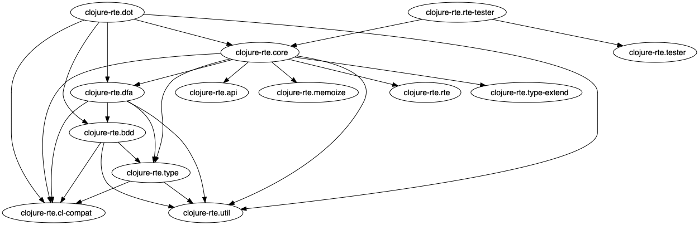

# clojure-rte

This package implements rational type expressions (RTEs) for the 
[Clojure](https://clojure.org) programming language.
The implementation is based on a similar package for 
[Common Lisp](https://lisp-lang.org).
The theory of how RTEs work can be found here: 
[Type-Checking of Heterogeneous Sequences in Common Lisp](https://www.lrde.epita.fr/wiki/Publications/newton.16.els) and [Representing and Computing with Types in Dynamically Typed Languages](https://www.lrde.epita.fr/wiki/Publications/newton.18.phd)

An important aspect of this implementation is that a regular type
expression pattern is represented internally (after compilation with
`rte-compile`) as a deterministic symbolic finite automaton.


This means that after the pattern has been compiled, the time complexity of 
matching a sequence, `rte-match`, against a pattern has linear time complexity `O(n)` where `n` is the 
length of the sequence.  I.e., the time to perform the match is not a function 
of the complexity of the pattern; it is only a function of the sequence
length.  On the contrary, the time to compile the pattern depends on
the complexity of the pattern, and may be exponential in worst case.
For this reason, patterns are compiled and automatically memoized
via the clojure [`memoize`](https://clojuredocs.org/clojure.core/memoize)
function.

In some cases the sequence can be determined to match the pattern
without examining the entire sequence.  For example if the pattern is,
`(:cat Long (:* Double))`, then as soon as the first item fails to be
a `Long`, we need not examine the rest of the sequence because we know
it failed to match. Likewise if the pattern is `(:cat Long (:*
:sigma))`, then after verifying that the first element is a `Long`, we
need not examine the remaining elements because we know it has
matched.

If the given sequence is a lazy sequence with side-effects, in some
cases the side effects may be circumvented.  The caller cannot be
assured that the side-effects will be achieved.

## Installation

Download from [LRDE](https://www.lrde.epita.fr/wiki/Home) GitLab 

```
git clone git@gitlab.lrde.epita.fr:jnewton/clojure-rte.git)
```
 or
```
git clone https://gitlab.lrde.epita.fr/jnewton/clojure-rte.git
```

## RTE in more depth

* [Binary Decision Diagrams](bdd.md)
* [Extensible Types](type.md)
* [Expert details w.r.t. RTE](expert.md)
* [API](api.md)
* [destructuring-fn](dsc.md)
* [destructuring-case](dsc.md/#destructuring-case)
## Usage

RTE allows the Clojure programmer to specify regular patterns of types
in sequences.  The pattern language resembles that of regular
expressions for strings, so the user very quickly has an intuition of
how it works.

Whereas with string regular expressions, where the leaf level thing you
specify is a character such as `"a*b+"` which means a string of
characters consisting of zero or more `'a'` characters followed by one or
more `'b'` characters; with regular type expressions you specify
type-designators, and repetition information about those types.
Rather than using post-fix notation we use lisp-friendly prefix
notation.  `(:* String)` means a sequence of objects consisting of zero
or more objects of type `String`.  The concept of *followed-by* is made
explicit by the `:cat` operator such as: `(:cat (:* Long) (:+String))`
a sequence consisting of zero or more objects of type `Long`
followed (in the same sequence) by one or more objects of type `String`.

Which kinds of type designators can be used?  You may use 

- Any type name which is a symbol, `T` for which `(class? (resolve T))` evaluates to Boolean true.
- Any name which is an element of the set returned from `(supported-non-trivial-types)`, equivalently if `(registered-type? T)` returns `true`.
- Any *quasi-type* name mentioned in `*rte-known*`.

The dynamic variable `*rte-known*` is intended for applications to
extend but comes equipped with several useful *quasi-types*. For example,
`integer?` means `(:or Integer
                   Long
                   clojure.lang.BigInt
                   BigInteger
                   Short
                   Byte)`, and `int?` means `(:or Long Integer Short Byte)`.


## Options

RTE supports the following keywords `:cat`, `:+`, `:*`, `:?`, `:exp`, `:and`, `:or`, `:permute`, `:contains-any`, `:contains-every`, `:contains-none`, 
`:empty-set`, `:sigma`, `:epsilon`, and `:not`.


* `(:cat ...)` --- Takes 0 or more operands.  Matches a sequence of patterns.

Example 

```clojure
(let [rte (rte-compile '(:cat integer? String))]
  (rte-match rte [1 "hello"]) ;; true
  (rte-match rte [1.0 "hello"]) ;; false
  (rte-match rte [1 2]) ;; false
  (rte-match rte [1 2 "hello"]) ;; false
  )
```

* `(:+ ...)` --- Takes exactly one operand.  Matches 1 or more times.

Example 

```clojure
(let [rte (rte-compile '(:+ integer?))]
  (rte-match rte [1 2 3 4 5]) ;; true
  (rte-match rte [1]) ;; true
  (rte-match rte []) ;; false
  (rte-match rte [1.0 2 3.0 4 5]) ;; false
  )
```

* `(:* ...)` --- Takes exactly one operand.  Matches 0 or more times.

Example 

```clojure
(let [rte (rte-compile '(:* integer?))]
  (rte-match rte [1 2 3 4 5]) ;; true
  (rte-match rte [1]) ;; true
  (rte-match rte []) ;; true
  (rte-match rte [1.0 2 3.0 4 5]) ;; false
  )
```

* `(:? ...)` --- Takes exactly one operand. Matches 0 or 1 time.

Example 

```clojure
(let [rte (rte-compile '(:? integer?))]
  (rte-match rte [1]) ;; true
  (rte-match rte []) ;; true
  (rte-match rte [1 2]) ;; false
  )

(let [rte (rte-compile '(:cat integer? (:? String)))]
  (rte-match rte [1 2 3 4 5]) ;; true
  (rte-match rte [1 2 3 4 5 "hello"]) ;; true
  (rte-match rte [1 2 3 4 5 "hello" "world"]) ;; false
  )
```

* `(:exp n pattern)` ---  `:exp` takes exactly two arguments, indicating the number of occurances, and a pattern.

Example --- to match a sequence 0 to 5 Integers,

```clojure
(let [rte (rte-compile '(:exp 5 (:? integer?)))]
   (rte-match rte []) ;; true
   (rte-match rte [1 2 3]) ;; true
   (rte-match rte [1 2 3 3 4 5 6]) ;; false
   )
```

* `(:and ...)` ---  Takes 0 or more operands.  Simultaneously matches all of the given patterns.

Example ---  Keyword followed by 1 or two integers, repeated any number of 
times which is a multiple of 3 total items.

```clojure
(let [rte (rte-compile '(:and (:* (:cat Keyword integer? (:? integer?)))
                              (:+ (:sigma :sigma :sigma))))]
  (rte-match rte [:x 1 :x 2 :x 3]) ;; true
  (rte-match rte [:x 1 2 :y 2 3]) ;; true
  (rte-match rte [:x 1 :y 3]) ;; false
  )
```


* `(:or ...)` --- matches any of the given patterns.

Example  ---  Takes 0 or more operands.  Either 0 or more integers, or 1 or 
more strings.

```clojure
(let [rte (rte-compile '(:or (:* integer?) (:+ String)))]
  (rte-match rte []) ;; true, 0 integers
  (rte-match rte [1 2 3]) ;; true
  (rte-match rte ["hello" "world"]) ;; true one or more strings
  )
```


* `(:permute ...)` ---  Takes 0 or more operands.  Matches a sequence in any order.

Example --- two integers and a string in any order.  

WARNING, the number of permutations explodes as n!.  Using `:permute`
of a large number of operations will make the compilation extremely
slow, and perhaps exhaust virtual memory.

```clojure
(let [rte (rte-compile '(:permute integer? integer? String))]
  (rte-match rte [1 2 "hello"]) ;; true
  (rte-match rte [1 "hello" 2]) ;; true
  (rte-match rte ["hello" 1 2]) ;; true
  (rte-match rte ["hello" 2]) ;; false
  (rte-match rte [1 2]) ;; false
  )
```

* `(:contains-any ...)` ---  Takes 0 or more operands.  Matches a sequence if it contains a factor which 
matches any of the given patterns.  A *factor* is a consecutive subsequence: `[1 2 3]` is a factor of `[0 1 2 3 4]`
but `[2 4]` is not a factor.

```clojure
(let [rte (rte-compile '(:contains-any integer?))]
  (rte-match rte [1 2 "hello"]) ;; true
  (rte-match rte ["hello" 2 "world"]) ;; true
  )

(let [rte (rte-compile '(:contains-any integer? String))]
  (rte-match rte [1 2 "hello"]) ;; true
  (rte-match rte ["hello" 2 "world"]) ;; true
  (rte-match rte [1 2 false]) ;; true
  (rte-match rte [true "hello" false]) ;; true
  )

(let [rte (rte-compile '(:contains-any (:cat Long Long) (:cat Double Double)))]
  (rte-match rte [1 2 "hello"]) ;; true because it contains (:cat Long Long)
  (rte-match rte ["hello" 2.0 3.0 "world"]) ;; true (:cat Double Double)
  (rte-match rte [1 false 2 false 1.0 false 2.0]) ;; false
  )
```

* `(:contains-every ...)` ---  Takes 0 or more operands.  Matches a sequence if it for each pattern
the sequence contains a factor which matches the pattern.

```clojure
(let [rte (rte-compile '(:contains-every integer?))]
  (rte-match rte [1 2 "hello"]) ;; true
  (rte-match rte ["hello" 2 "world"]) ;; true
  )

(let [rte (rte-compile '(:contains-every integer? String))]
  (rte-match rte [1 2 "hello"]) ;; true
  (rte-match rte ["hello" 2 "world"]) ;; true
  (rte-match rte [1 2 false]) ;; false because it does not contains String
  (rte-match rte [true "hello" false]) ;; false because it does not contain integer?
  )

(let [rte (rte-compile '(:contains-any (:cat Long Long) (:cat Double Double)))]
  (rte-match rte [false 1 2 "hello" 1.0 2.0]) ;; true because it contains (:cat Long Long) and also (:cat Double Double)
  (rte-match rte [1 2 "hello"]) ;; false because it does not contain (:cat Double Double)
  (rte-match rte ["hello" 2.0 3.0 "world"]) ;; false because it does not contain (:cat Long Long)
  )
```

* `(:contains-none ...)` ---  Takes 0 or more operands.  This is the same as `(:not (:contains-any ...))`.
Warning, `(:contains-any)` with no arguments is the same as `:epsilon`, so `(:contains-none)` is the
same as `(:not :epsilon)`.

* `:empty-set` --- identity for `:or`.

Example any number of integers or strings in any order.

```clojure
(let [rte (rte-compile '(:* (:or integer? String)))]
  (rte-match rte [1]) ;; true
  (rte-match rte [1 "hello"]) ;; true
  (rte-match rte ["hello" "world" 1 2 "hello" 3 "world"]) ;; true

```


* `:sigma` --- matches anything once, identity for `:and`.

Example -- any number of repetitions of integer anything String.

```clojure
(let [rte (rte-compile '(:* (:cat integer? :sigma String)))]
  (rte-match rte []) ;; true
  (rte-match rte [1]) ;; false
  (rte-match rte [1 2]) ;; false
  (rte-match rte [1 "hello" 2]) ;; true
  (rte-match rte [1 "hello" 2 3 "world" 4 1 "hello" 2 3 "world" 4]) ;; true
  )
```

* `:epsilon` --- matching nothing once, identity for `:cat`.  This is probably
not useful to the end user.  However, internally `(:? x)` expands to 
`(:or x :epsilon)`.

* `(:not ...)` --- Takes exactly one operand.  Matches any sequence
except ones which match the pattern.  This can be confusing. See section
[Hierarchical Sequences](expert.md/#hierarchical-sequences) for details.

Example -- `String` matches a singleton sequence whose element is a string.  
So `(:not String)` matches any sequence except one of length 1 consisting of a
string, including matching the empty sequence.

```clojure
(rte-match '(:not String) []) ;; true
(rte-match '(:not String) ["hello"]) ;; false
(rte-match '(:not String)["hello" "world"]) ;; true
```

## Examples

```clojure
(rte-match '(:cat (:* (:cat clojure.lang.Keyword java.lang.Long))
                  (:? String))
           '(:x 1 :y 2 :z 42)) ;; --> true

(let [rte (rte-compile '(:cat (:* (:cat clojure.lang.Keyword java.lang.Long))
                              (:? String)))]
  (rte-match '(:x 1 :y 2 :z 42)) ;; --> true
  (rte-match '(:x 1 :y 2 :z 42 "Hello")) ;; --> true
  (rte-match '(:x 1 :y 2 :z 42 "Hello" "World")) ;; --> false
)
```


## Not yet implemented

There are several outstanding issues.  
[See them here](https://gitlab.lrde.epita.fr/jnewton/clojure-rte/-/issues).

## Package dependencies overview



Package dependency graph of clojure-rte generated by 
<!--  run the following in the top level project dir to regenerate img/ns-dep-graph.png
sh> rm img/ns-dep-graph.png
sh> lein ns-dep-graph -name img/ns-dep-graph
 -->
[lein-ns-dep-graph](https://github.com/hilverd/lein-ns-dep-graph).


## Contributors

[Jim Newton](https://www.lrde.epita.fr/wiki/User:Jnewton)

## License
```
Copyright (c) 2020 EPITA Research and Development Laboratory

Permission is hereby granted, free of charge, to any person obtaining
a copy of this software and associated documentation
files (the "Software"), to deal in the Software without restriction,
including without limitation the rights to use, copy, modify, merge,
publish, distribute, sublicense, and/or sell copies of the Software,
and to permit persons to whom the Software is furnished to do so,
subject to the following conditions:

The above copyright notice and this permission notice shall be
included in all copies or substantial portions of the Software.

THE SOFTWARE IS PROVIDED "AS IS", WITHOUT WARRANTY OF ANY KIND,
EXPRESS OR IMPLIED, INCLUDING BUT NOT LIMITED TO THE WARRANTIES OF
MERCHANTABILITY, FITNESS FOR A PARTICULAR PURPOSE AND
NONINFRINGEMENT. IN NO EVENT SHALL THE AUTHORS OR COPYRIGHT HOLDERS BE
LIABLE FOR ANY CLAIM, DAMAGES OR OTHER LIABILITY, WHETHER IN AN ACTION
OF CONTRACT, TORT OR OTHERWISE, ARISING FROM, OUT OF OR IN CONNECTION
WITH THE SOFTWARE OR THE USE OR OTHER DEALINGS IN THE SOFTWARE.
```

<!--  LocalWords:  Clojure LRDE GitLab gitlab https rte src img RTEs
 -->
<!--  LocalWords:  DSL DFA unioned
 -->
