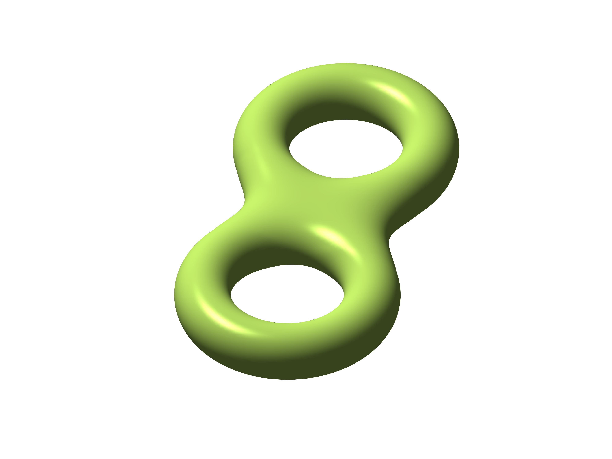

# Genus - A Simple Extensible Type System



The Genus Simple Extensible Type System, provides a way to reason about set of objects
at run-time.  

When we use the word `type` we DO NOT mean Java type, rather we mean a set of clojure values or objects.
Any set of values is a type, and some types are designatable.   Types correspond to sets, and subtypes
correspond to subsets.


The namespace `clojure-rte.genus` defines a type system which extends the
Clojure built-in type system.   Types are sets of objects. Some types may be 
designated via so-called *type designators*.

A *type designator* is defined by the following recursive definition.
  If `A` and `B` are type designators, then
  
  - Any symbol designates a type, provided it can be resolved with the function `resolve`, and the resulting value is `true` according to the `class?` predicate.  I.e., if the predicate `(fn [x] (and (symbol? x) (resolve x) (class? (resolve x))))` is returns `true`.

  - `(and A B)` is a type designator, designating the set of values which are simultaneously of type `A` and `B`. `(and ...)` may have arbitrarily many operands. `(and A)` means `A`, and `(and)` means the empty set of all possible.

  - `(or A B)` is a type designator, designating the set of values which are of type `A` or of type `B`, or perhaps of both. `(or ...)` may have arbitrarily many operands.  `(or A)` means `A`, and `(or)` means the empty set of values.

  - `(not A)` is a type designator, designating the set of values which are *not* of type `A`.

  - `(= x)`  is a type designator, designating the set of all values which are equal `=` to its literal operand.  For example `(= 42)` is the set of all values equal to 42, which include among others the `java.lang.Long 42`, the `java.lang.Short 42`, and the  `java.lang.Byte 42`.

  - `(member x y z ...)` is a type designator equivalent to `(or (= x) (= y) (= z) ...)`.
  
  - `(satisfies f)` is a type designator if `f` names a function which implements a type predicate. The type predicate designator may be a simple symbol indicating a type predicate built in clojure (i.e., defined in clojure.core), such as `int?`, `decimal?`, `vector?`.
 A user defined function may also be used, but its fully qualified name must be specified such as `(satisfies my-namespace/my-f)`. The behavior is expressly undefined if the definition of such a function (such as `my-f`) is redefined.  The system may well have cached information about the function which becomes incorrect but never invalided.
 The system attempts to implement `satisfies` efficiently when possible.  For example, `(satisfies int?)` expands internally to `(or Long Integer Short Byte)`.  Such optimization applies equally well to user defined functions.

  - `(rte pattern)` is a type designator which specifies the set of sequences which match the given rte pattern.  For example, the type `(rte (:cat Long String))` is the set of two element sequences whose first element is a `Long` and whose second element is a string.


The user interface to `clojure-rte.genus` includes the following functions:

* `typep [value type-designator]` --- predicate to determine whether a given object is an element of a designated type.

Example 
```clojure
(typep 42 'Long) ;; true
(typep "42" '(not Long)) ;; true
```

* `subtype? [sub super]` --- predicate to determine whether one type is a subtype of another.  I.e., for any `x` in `t1` is it tru that `x` is also in `t2` ?  There are three possible answers to this question, `true`, `false`, and `:dont-know`.

Example 
```clojure
(subtype? 'Long '(or Long Double)) ;; true
(subtype? 'Long '(or String (not Long))) ;; false
```

* `disjoint? [t1 t2]` --- predicate to determine whether two types are disjoint in the sense that their intersection is empty. There are three possible answers to this question, `true`, `false`, and `:dont-know`.

Example 
```clojure
(disjoint? 'Long 'Double) ;; true
(disjoint? 'Number 'java.io.Serializable) ;; false
```

* `inhabited? [type-designator]` --- predicate to determine whether there exists an element of a given type.  Any type which is not inhabited is vacuous. There are three possible answers to this question, `true`, `false`, and `:dont-know`.

Example 
```clojure
(inhabited? 'Long) ;; true
(inhabited? '(rte (:and (:+ Number) (:+ String)))) ;; false
```

## How to extend the type system

An application may extend the type system by adding a new type
designator syntax.  To do so, several steps must be followed.

### Registering the existance of the new type

To declare a new type as existing and supported by rte, you must register
by added a method via `defmethod registered-type?` returning `true`.

```clojure
(defmethod registered-type? 'my-type [_] true)
```

### Determine whether a given element is a member of the new type

Additional several methods must be added to allow
the system to reason about the new type.


* `typep [value type-designator]` --- Applications defining new types
should define a method on `typep` which decides whether a given value 
is a member of that type.  This method will be called when the sytem has 
already determined that the type designator is a `sequential?` whose first 
element is your type name e.g., `my-type`. Thus the logic within the method 
body has the task of determining whether the given  object `my-value` is an 
element of the designated type.


 Example:
```clojure
(defmethod typep 'member [a-value [_type & others]]
  (boolean (cond
             (nil? target) (some nil? items)
             (false? target) (some false? items)
             :else (some #{target} items))))

(defmethod typep 'my-type [a-value [_type & others]]
  ... some logic ...)
```

### Determine various characteristics of the new type

The system reasons about types via an interface defined by the
functions: `registered-type?`, `typep`, `inhabited?`, `disjoint?`, and 
`subtype?`.  While you are expected to add a method `registered-type?` and 
`typep` for your new type, you must not add methods to `inhabited?`, 
`disjoint?`, or `subtype?`. To fully implement a new type, you must provide 
several methods which extend some built-in multimethods:  `-inhabited?`, 
`-disjoint?`, and `-subtype?`.

These multimethods should never be called; rather each method thereof
will be called by a mechanism different from the multimethod.  In each
case, the system calls the methods in some order (which you cannot
control) until one method returns either `true` or `false`.  As a
convention each method should return `:dont-know` if it cannot decide
between `true` and `false`.

The task of each method is to determine whether or not the type in question
is in play.  For example, if you are implementing a type named `my-type`,
then your method may be called with other type designators other than `my-type`
in which your method should recognize this and return `:dont-know`.

For example, if you are implementing `my-type` and `-inhabited?` is called with
argument `(foo 1 2 3)`, your `-inhabited?` method should recognize that
the type is not `(my-type ...)` and should return `:dont-know`.  If the
argument is `(my-type ...)`, then and only then should it examine the arguments
and proceed making its decision to return `true` or `false`.

When installing a method such as `-inhabited?`, for an application specific 
type, it is the responsibility of the method to detect whether the type 
designator syntax is correct, and return `:dont-know` or signal an error.
If the method does not recognize the syntax, then return `:dont-know`.
If the method recognizes the syntax to be invalid, then signal an error.
For example, if you are implementing `my-type`, and you have determined that
any `my-type` type designator must specify exactly one operand such as 
`(my-type 3)`, and if the given type designator is `(my-type 3 4)`, you should 
determine that the number of operands IS NOT 1, so you my signal an error such 
as with a call to:
```clojure
(defmethod -inhabited? 'my-type [type-designator]
  (cond
   (not (sequential? type-designator))
   :dont-know

   (not= 'my-type (first type-designator))
   :dont-know

   (not= 2 (count my-type))
   (throw (ex-info (format "invalid syntax %s" type-designator)
                   {:type-name 'my-type
                    :type-designator type-designator}))

   :else
   ... some logic ...
   )
```

### Determining whether a type is inhabited or vacuous

* `-inhabited?` ---   

Applications may install methods via `(defmethod -inhabited? ...)`.
The method accepts one argument which is a type-designator,
pontentially application specific.  The method should examine the type
designator and return `true`, `false`, or `:dont-know` depending on
whether there exists an object of this type.  If the designated type
is empty, return `false`; if it is not empty, return `true`; if it is
not possible to programmatically determine whether the type is empty
(e.g., because of the halting problem, or because not enough
information is given) return `:dont-know`.


When `inhabited?` (the public calling interface) is called,
the methods of `-inhabited?` are called in some order
(`:primary` first) until one method returns `true` or `false`,
in which case `inhabited?` returns that value.
If no method returns `true` or `false`, then the function
`*inhabited?-default*` is called, and its value returned.
If `inhabited?` is called with a 3rd argument, then
`*inhabited?-default*` is dynamically bound to that value."

```clojure
(defmethod -inhabited? 'my-type [type-designator]
  (if (and (sequential? type-designator)
           (= 'my-type (first type-designator)))
    (... some logic ...)
    :dont-know))
```

### Determining whether two types are disjoint or intersecting.


* `-disjoint?` ---   

Applications may install methods via `(defmethod -disjoint? ...)`.
The method accepts two arguments which are type-designators,
`[t1 t2]`,  pontentially application specific.
The method should examine the designated types to determine whether
the designated types are disjoint, i.e., whether they have no
element in common, i.e., whether their intersection is empty.
The method must return `true`, `false`, or `:dont-know`.
The function, disjoint?, will call `(-disjoint? t1 t2)`
and also `(-disjoint? t2 t1)` if necessary, therefore
the methods need only check one or the other.
When `disjoint?` (the public calling interface) is called,
the methods of -disjoint? are called in some order
(`:primary` first) until one method returns `true` or `false`,
in which case `disjoint?` returns that value.
If no method returns `true` or `false`, then the function
`*disjoint?-default*` is called, and its value returned.
If `disjoint?` is called with a 3rd argument, then
`*disjoint?-default*` is dynamically bound to that value.
    

### Determining whether one type is a subtype of another

* `-subtype?` ---  

Applications may install methods via `(defmethod -subtype? ...)`.
The method accepts two arguments which are type-designators,
`[sub-designator super-designator]`,  pontentially application specific.
The method should examine the designated types to determine whether
they have a subtype relation, and return `true`, `false`, or `:dont-know`.
When `subtype?` (the public calling interface) is called,
the methods of `-subtype?` are called in some order
(`:primary` first) until one method returns `true` or `false`,
in which case `subtype?` returns that value.
If no method returns `true` or `false`, then the function
`*subtype?-default*` is called, and its value returned.
If subtype? is called with a 3rd argument, then
`*inhabited?-default*` is dynamically bound to that value.

For more information, see the documentation in the source code.

